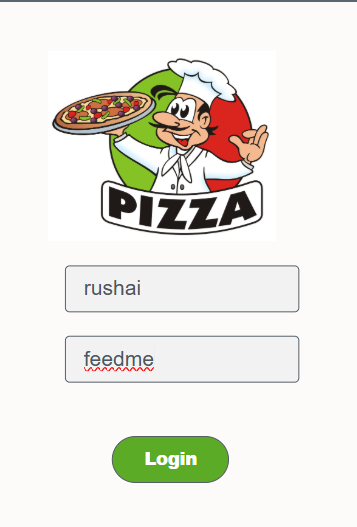
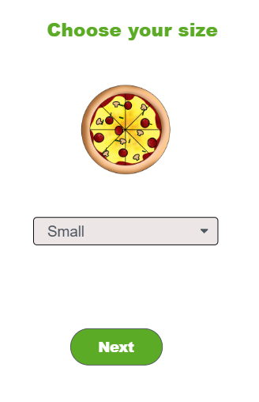
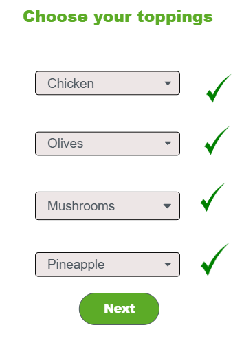
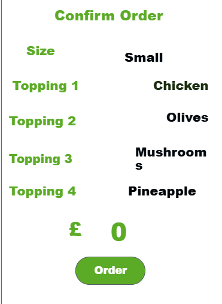
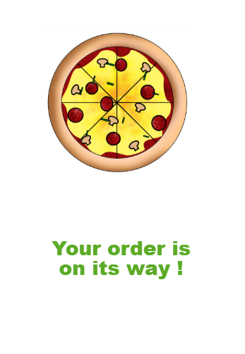

# pizza-app
Pizza ordering web app built using Code.org App Lab (JavaScript, HTML, CSS).
A simple interactive pizza ordering web application built using Code.org App Lab.

## Features
- User login screen
- Pizza size selection
- Dynamic image scaling
- Basic input validation
- Event-driven JavaScript logic

## Technologies Used
- JavaScript
- HTML
- CSS
- Code.org App Lab

## What I Learned
- Event handling in JavaScript
- Conditional logic and input validation
- DOM manipulation
- Structuring UI-based applications

## How to Run
Download the repository and open `index.html` in a web browser.
## Screenshots

